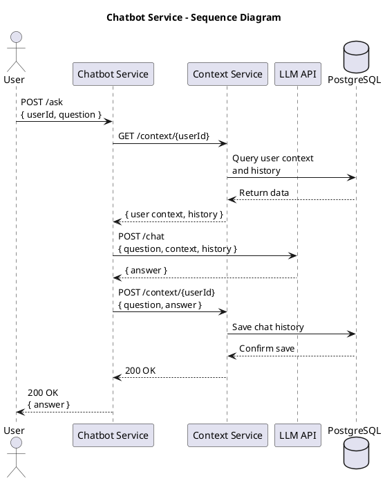

# Chatbot Service

A chatbot service that integrates with OpenAI's GPT models and maintains user context.

## Repository Structure

```
.
├── app/                    # Main application code
├── docker/                 # Docker configuration files
│   ├── Dockerfile         # Main service Dockerfile
│   ├── Dockerfile.context # Context service Dockerfile
│   ├── Dockerfile.test    # Test service Dockerfile
│   └── docker-compose.yml # Service orchestration
├── scripts/               # Utility scripts
│   └── test_api.sh       # API testing script
├── tests/                 # Test suite
│   ├── test_services.py  # Main test suite
│   ├── test_openai.py    # OpenAI integration tests
│   ├── test_database.py  # Database tests
│   └── test-requirements.txt # Test dependencies
├── requirements.txt       # Main service dependencies
├── README.md             # This file
├── .dockerignore         # Docker ignore rules
└── .gitignore           # Git ignore rules
```

## Architecture

The service consists of three main components:
1. Chatbot Service (Main API) - Handles user questions and coordinates responses
2. Context Service - Manages user context and conversation history
3. LLM Integration - Connects with OpenAI's GPT models

### Sequence Diagram



This sequence diagram illustrates the complete flow of the chatbot service, including:
1. User sends a question with their ID
2. Chatbot service retrieves user context and history
3. Question is processed by LLM with context and history
4. Answer is saved to history
5. Response is sent back to user

## Development Options

You can run this service either locally for development or using Docker containers for deployment.

### Option 1: Local Development

1. Create a virtual environment and activate it:
```bash
python -m venv venv
source venv/bin/activate  # On Windows use: venv\Scripts\activate
```

2. Install dependencies:
```bash
pip install -r requirements.txt
```

3. Create a `.env` file in the root directory:
```
# OpenAI API Key (optional for testing)
OPENAI_API_KEY=your_openai_api_key_here

# PostgreSQL Database URL (update username with your system username)
DATABASE_URL=postgresql://your_username@localhost/chatbot

# Context Service URL (optional, defaults to http://localhost:8001)
# CONTEXT_SERVICE_URL=http://localhost:8001
```

4. Install PostgreSQL (if not already installed):
```bash
brew install postgresql
```

5. Start PostgreSQL service:
```bash
brew services start postgresql
```

6. Create the database:
```bash
createdb chatbot
```

7. Start the Chatbot Service:
```bash
python app/main.py
```
The service will run on http://localhost:8000

### Option 2: Docker Deployment

1. Make sure you have Docker and Docker Compose installed.

2. Create a `.env` file with your OpenAI API key:
```
OPENAI_API_KEY=your_openai_api_key_here
```

3. Build and start all services:
```bash
cd docker
docker-compose up -d
```

This will start:
- Chatbot service on http://localhost:8000
- Context service on http://localhost:8001
- PostgreSQL database on port 5432

4. View service logs:
```bash
# View all logs
docker-compose logs -f

# View specific service logs
docker-compose logs -f chatbot
docker-compose logs -f context
docker-compose logs -f db
```

5. Stop all services:
```bash
docker-compose down
```

## Running Tests

### Local Testing

1. Install test dependencies:
```bash
pip install -r tests/test-requirements.txt
```

2. Run the tests:
```bash
python -m pytest tests/ -v
```

### Containerized Testing

Run the automated test suite in a container:
```bash
# Run tests and follow logs
cd docker && docker-compose up test

# Run tests and exit
cd docker && docker-compose run --rm test
```

## API Documentation & Testing

### Using Swagger UI (Recommended)

1. Access the Swagger UI documentation:
```
http://localhost:8000/docs
```

2. Test the `/ask` endpoint:
   - Click on the `/ask` endpoint
   - Click "Try it out"
   - Enter a request body like:
     ```json
     {
       "userId": "test_user",
       "question": "hello"
     }
     ```
   - Click "Execute"
   - View the response

3. Test the `/history/{user_id}` endpoint:
   - Click on the `/history/{user_id}` endpoint
   - Click "Try it out"
   - Enter "test_user" in the user_id field
   - Click "Execute"
   - View the chat history

### API Endpoints

#### Chatbot Service (Port 8000)

- GET `/` - API information and available endpoints
- POST `/ask` - Ask a question to the chatbot
  - Request body: `{"userId": "string", "question": "string"}`
  - Returns: `{"answer": "string"}`
- GET `/history/{user_id}` - Get chat history for a user
  - Returns: Array of chat messages with questions and answers

#### Documentation

- `/docs` - Swagger UI documentation (interactive)
- `/redoc` - ReDoc documentation (alternative view)

#### Context Service (Port 8001)

- GET `/context/{user_id}`
  - Returns the user's context
- POST `/context/{user_id}`
  - Updates the user's context
  - Request body: `{"user_id": "string", "preferences": {}, "history": []}`

### Database Verification

The project includes a database testing script (`tests/test_database.py`) for local development. Install the additional requirement:

```bash
pip install tabulate
```

Use the script in different ways:

1. Show all information:
```bash
python tests/test_database.py
```

2. Show statistics only:
```bash
python tests/test_database.py --stats
```

3. Show all chat history:
```bash
python tests/test_database.py --all
```

4. Show chat history for a specific user:
```bash
python tests/test_database.py --user test_user
```

Suggested testing sequence:

1. Start with an empty database
2. Make a test request in Swagger UI
3. Check the database with the testing script
4. Make more requests with different users/questions
5. View statistics

The script will show you:
- Total number of conversations
- Number of unique users
- Latest conversation
- Most active user
- Detailed chat history with timestamps 