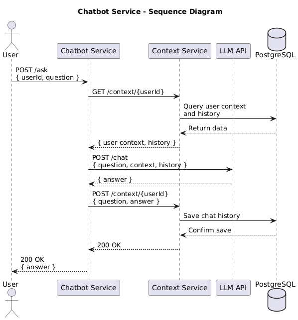

# Chatbot Service

A chatbot service that integrates with OpenAI's GPT models and maintains user context.

## Repository Structure

```
.
├── app/                    # Main application code
├── docker/                 # Docker configuration files
│   ├── Dockerfile         # Main service Dockerfile
│   ├── Dockerfile.context # Context service Dockerfile
│   ├── Dockerfile.test    # Test service Dockerfile
│   └── docker-compose.yml # Service orchestration
├── scripts/               # Utility scripts
│   └── test_api.sh       # API testing script
├── tests/                 # Test suite
│   ├── test_services.py  # Main test suite
│   ├── test_openai.py    # OpenAI integration tests
│   ├── test_database.py  # Database tests
│   └── test-requirements.txt # Test dependencies
├── requirements.txt       # Main service dependencies
├── README.md             # This file
├── .dockerignore         # Docker ignore rules
└── .gitignore           # Git ignore rules
```

## Architecture

The service consists of three main components:
1. Chatbot Service (Main API) - Handles user questions and coordinates responses
2. Context Service - Manages user context and conversation history
3. LLM Integration - Connects with OpenAI's GPT models

### Sequence Diagram



This sequence diagram illustrates the complete flow of the chatbot service, including:
1. User sends a question with their ID
2. Chatbot service retrieves user context and history
3. Question is processed by LLM with context and history
4. Answer is saved to history
5. Response is sent back to user

## Development Options

You can run this service either locally for development or using Docker containers for deployment.

### Option 1: Local Development

1. Create a virtual environment and activate it:
```bash
python -m venv venv
source venv/bin/activate  # On Windows use: venv\Scripts\activate
```

2. Install dependencies:
```bash
pip install -r requirements.txt
```

3. Create a `.env` file in the root directory:
```
# OpenAI API Key (optional for testing)
OPENAI_API_KEY=your_openai_api_key_here

# PostgreSQL Database URL (update username with your system username)
DATABASE_URL=postgresql://your_username@localhost/chatbot

# Context Service URL (optional, defaults to http://localhost:8001)
CONTEXT_SERVICE_URL=http://localhost:8001
```

4. Install PostgreSQL (if not already installed):
```bash
brew install postgresql
```

5. Start PostgreSQL service:
```bash
brew services start postgresql
```

6. Create the database:
```bash
createdb chatbot
```

7. Start the Context Service:
```bash
python app/context_service.py
```
The service will run on http://localhost:8001

8. Start the Chatbot Service:
```bash
python app/main.py
```
The service will run on http://localhost:8000

### Option 2: Docker Deployment

1. Make sure you have Docker and Docker Compose installed.

2. Create a `.env` file in the docker folder:
```
# Database Configuration (required)
POSTGRES_USER=your_postgres_username    # e.g., postgres
POSTGRES_PASSWORD=your_secure_password  # Choose a secure password
POSTGRES_DB=chatbot                    # Database name

# Context Service URL (optional, defaults to http://localhost:8001)
CONTEXT_SERVICE_URL=http://localhost:8001

# OpenAI Configuration (required)
OPENAI_API_KEY=your_openai_api_key_here
```

3. Build and start all services:
```bash
cd docker
docker-compose up -d
```

This will start:
- Chatbot service on http://localhost:8000
- Context service on http://localhost:8001
- PostgreSQL database on port 5432

4. View service logs:
```bash
# View all logs
docker-compose logs -f

# View specific service logs
docker-compose logs -f chatbot
docker-compose logs -f context
docker-compose logs -f db
```

5. Stop all services:
```bash
docker-compose down
```

## Running Tests

### Local Testing

1. Install test dependencies:
```bash
pip install -r tests/test-requirements.txt
```

2. Run the tests:
```bash
python -m pytest tests/ -v
```

### Containerized Testing

Run the automated test suite in a container:
```bash
# Run tests and follow logs
cd docker && docker-compose up test

# Run tests and exit
cd docker && docker-compose run --rm test
```

## Code Style and Formatting

This project uses Cursor IDE rules (`.cursorrules`) to maintain consistent code style and quality across the codebase.

### Python Code Style

- **Formatter**: Black with line length of 100 characters
- **Linter**: Flake8 with customized rules
- **Import Organization**: Enabled with Black profile
- **Type Checking**: MyPy with strict settings

Key Python style rules:
- Maximum line length: 100 characters
- Quote style: Double quotes
- Indentation: 4 spaces
- Trailing commas: Required
- Imports: Automatically sorted and unused imports removed

### YAML, Markdown, and JSON Formatting

- **YAML**:
  - Formatter: Prettier
  - Indentation: 2 spaces
  - Maximum line length: 100 characters
  - Quote style: Double quotes

- **Markdown**:
  - Formatter: Prettier
  - Maximum line length: 100 characters
  - Trailing punctuation: Required
  - Prose wrap: Always

- **JSON**:
  - Formatter: Prettier
  - Indentation: 2 spaces
  - Keys: Automatically sorted

### Using the Rules in Cursor IDE

1. The rules are automatically applied when using Cursor IDE
2. For manual formatting:
   - Python: Use Black formatter (`black .`)
   - YAML/Markdown/JSON: Use Prettier with appropriate parser
3. For type checking:
   - Run MyPy: `mypy .`
4. For linting:
   - Run Flake8: `flake8 .`

### Ignored Files and Directories

The `.cursorrules` configuration automatically ignores common Python artifacts and directories including:
- Virtual environments (`venv/`, `.venv/`)
- Cache directories (`__pycache__/`, `.pytest_cache/`)
- Build artifacts (`build/`, `dist/`, `*.egg-info/`)
- Test coverage reports (`.coverage`, `htmlcov/`)
- Environment files (`.env`)

## API Documentation & Testing

### Using Swagger UI (Recommended)

1. Access the Swagger UI documentation:
```
http://localhost:8000/docs  # Chatbot Service
http://localhost:8001/docs  # Context Service
```

### API Endpoints

#### Chatbot Service (Port 8000)

- GET `/` - API information and available endpoints
  ```bash
  curl http://localhost:8000/
  ```

- POST `/ask` - Ask a question to the chatbot
  ```bash
  curl -X POST http://localhost:8000/ask \
    -H "Content-Type: application/json" \
    -d '{
      "userId": "user123",
      "question": "What is my current learning progress?"
    }'
  ```
  Response:
  ```json
  {
    "answer": "Based on your learning path..."
  }
  ```

- GET `/history/{user_id}` - Get chat history for a user
  ```bash
  curl http://localhost:8000/history/user123
  ```
  Response:
  ```json
  [
    {
      "question": "What is my current learning progress?",
      "answer": "Based on your learning path...",
      "created_at": "2024-03-21T10:30:00.000Z"
    }
  ]
  ```

- GET `/context/{user_id}` - Get user's context and chat history
  ```bash
  curl http://localhost:8000/context/user123
  ```
  Response:
  ```json
  {
    "id": 1,
    "learning_preferences": {
      "preferred_learning_style": "visual",
      "time_availability": {
        "hours_per_week": 6,
        "preferred_schedule": "weekdays"
      }
    },
    "constraints": {
      "time_constraints": 9,
      "budget_constraints": 10
    },
    "background": {
      "education_level": "Bachelor's",
      "work_experience_years": "3",
      "current_role": "Software Developer",
      "industry": "Technology"
    },
    "skills": [
      {
        "id": 1,
        "name": "python",
        "category": "programming",
        "level": "intermediate",
        "description": "Python programming language proficiency"
      }
    ],
    "progresses": [
      {
        "target": {
          "id": 1,
          "title": "Backend Developer",
          "type": "Career Path",
          "description": "Backend development specialization"
        },
        "learning_path": {
          "id": 1,
          "title": "Python Expert Path",
          "progress": 60,
          "completion_date": "2025-06-13T16:09:02.736Z"
        }
      }
    ],
    "history": [
      {
        "question": "What is my current learning progress?",
        "answer": "Based on your learning path...",
        "created_at": "2024-03-21T10:30:00.000Z"
      }
    ]
  }
  ```

#### Context Service (Port 8001)

- GET `/context/{user_id}` - Get user's context
  ```bash
  curl http://localhost:8001/context/user123
  ```
  Response: Same structure as Chatbot Service's `/context/{user_id}` endpoint

- POST `/context/{user_id}` - Update user's context
  ```bash
  curl -X POST http://localhost:8001/context/user123 \
    -H "Content-Type: application/json" \
    -d '{
      "user_id": "user123",
      "learning_preferences": {
        "preferred_learning_style": "visual",
        "time_availability": {
          "hours_per_week": 6,
          "preferred_schedule": "weekdays"
        }
      },
      "constraints": {
        "time_constraints": 9,
        "budget_constraints": 10
      },
      "background": {
        "education_level": "Bachelor'\''s",
        "work_experience_years": "3",
        "current_role": "Software Developer",
        "industry": "Technology"
      },
      "skills": [
        {
          "id": 1,
          "name": "python",
          "category": "programming",
          "level": "intermediate",
          "description": "Python programming language proficiency"
        }
      ],
      "progresses": [
        {
          "target": {
            "id": 1,
            "title": "Backend Developer",
            "type": "Career Path",
            "description": "Backend development specialization"
          },
          "learning_path": {
            "id": 1,
            "title": "Python Expert Path",
            "progress": 60,
            "completion_date": "2025-06-13T16:09:02.736Z"
          }
        }
      ]
    }'
  ```
  Response:
  ```json
  {
    "status": "success",
    "message": "Context updated successfully"
  }
  ```

- POST `/chat/{user_id}` - Store a chat message
  ```bash
  curl -X POST http://localhost:8001/chat/user123 \
    -H "Content-Type: application/json" \
    -d '{
      "user_id": "user123",
      "question": "What is my learning progress?",
      "answer": "Based on your context..."
    }'
  ```
  Response:
  ```json
  {
    "status": "success",
    "message": "Chat message added successfully"
  }
  ```

#### Documentation

- `/docs` - Swagger UI documentation (interactive)
- `/redoc` - ReDoc documentation (alternative view)

### Database Verification

The project includes a database testing script (`